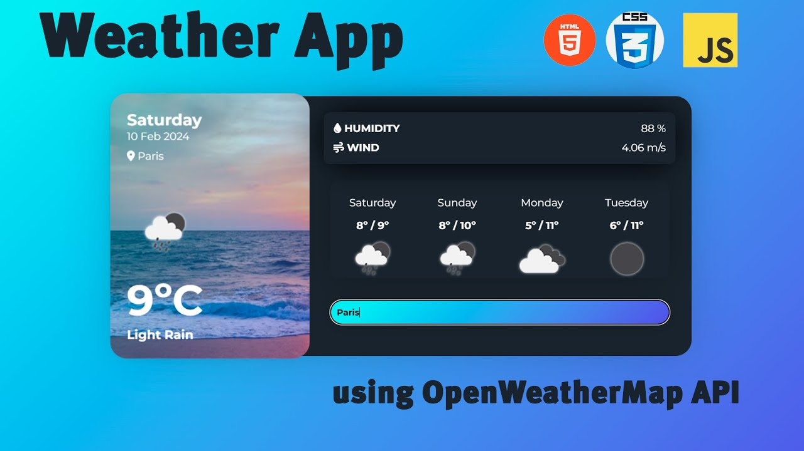

# 🌐 Personal Portfolio Website

A modern and responsive Personal Portfolio Website built using **HTML, CSS, and JavaScript**. This portfolio showcases my skills, education, projects, and contact details with a clean and attractive user interface.

---

## 🚀 Live Demo

🔗 **Portfolio Website:**  
https://yogibhokare18.github.io/Portfolio/

---

## 📌 Features

- 🏠 Responsive Home Page
- 👨‍💻 About Me Section
- 🛠️ Skills Showcase
- 💼 Projects Section
- 🎓 Education Timeline
- 📬 Contact Form
- 📄 Download Resume
- 🔗 Social Media Links
- ✨ Smooth Scrolling Navigation
- 📱 Mobile Responsive Design

---

## 🛠️ Technologies Used

- HTML5
- CSS3
- JavaScript
- Font Awesome
- Git
- GitHub

---

## 📂 Project Structure

```text
Portfolio/
│── index.html
│── style.css
│── script.js
│── README.md
│── Yoginand_Professional_Resume.pdf
│
└── images/
    ├── profile.jpg
    ├── student-management.jpg
    ├── e-commerce-website.jpg
    └── weather-app-api.jpg
```

---

## 📸 Project Preview

### 🏠 Home Page


---

### 💻 Student Management System


---

### 🛒 E-Commerce Website


---

### 🌦️ Weather App



---

## 👨‍💻 About Me

Hello! I'm **Yoginand Bhokare**, an MCA student passionate about **Full Stack Web Development**.

I enjoy building responsive and modern web applications using **HTML, CSS, JavaScript, Python, Django, and MySQL**.

My goal is to become a professional Software Engineer and continuously improve my programming and development skills.

---

## 💼 Featured Projects

### 🎓 Student Management System

A console-based Student Management System developed using Python and MySQL.

**Features**

- Add Student
- View Student
- Search Student
- Update Student
- Delete Student

**Technology Used**

- Python
- MySQL
- SQL

---

### 🛒 E-Commerce Website

Modern responsive E-Commerce Website with interactive UI.

**Features**

- Responsive Design
- Product Listing
- Category Filter
- Product Search
- Shopping Cart
- JavaScript Functionality

**Technology Used**

- HTML
- CSS
- JavaScript

---

### 🌦️ Weather App

Responsive Weather Application using OpenWeatherMap API.

**Features**

- Live Weather
- Search by City
- Temperature
- Humidity
- Wind Speed
- API Integration

**Technology Used**

- HTML
- CSS
- JavaScript
- OpenWeatherMap API

---

## 🎓 Education

### Master of Computer Applications (MCA)

- College: Dnyanopasak Shikshan Mandal's College, Parbhani
- University: Swami Ramanand Teerth Marathwada University, Nanded
- Duration: 2026 – 2028
- Status: Pursuing

### Bachelor of Computer Applications (BCA)

- College: Shri Shivaji College, Parbhani
- University: Swami Ramanand Teerth Marathwada University, Nanded
- Percentage: 71%
- Status: Completed

### Higher Secondary Certificate (HSC)

- Percentage: 64%

### Secondary School Certificate (SSC)

- Percentage: 79%

---

## 💻 Skills

- HTML5
- CSS3
- JavaScript
- Python
- Django
- MySQL
- Git
- GitHub

---

## 📬 Contact

**Name:** Yoginand Bhokare

- GitHub: https://github.com/yogibhokare18
- LinkedIn: https://www.linkedin.com/in/yoginand-bhokare-725b51275/
- Email: yoginandb@gmail.com

---

## ⚙️ Installation

Clone the repository

```bash
git clone https://github.com/yogibhokare18/Portfolio.git
```

Open the project folder.

Run `index.html` in your browser.

---

## ⭐ Support

If you like this project, don't forget to ⭐ Star this repository.

---

## 📄 License

This project is created for learning and portfolio purposes.
